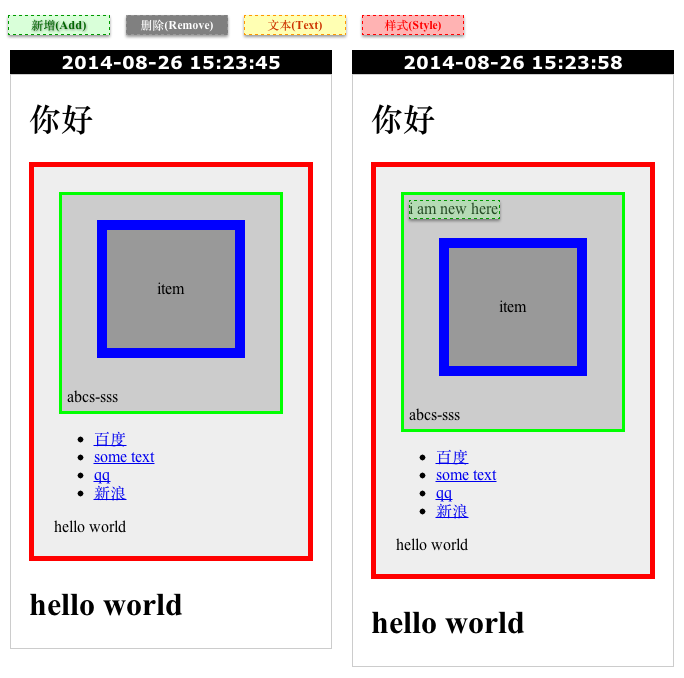
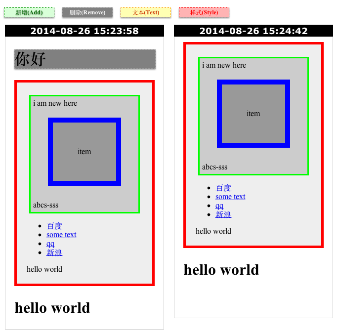
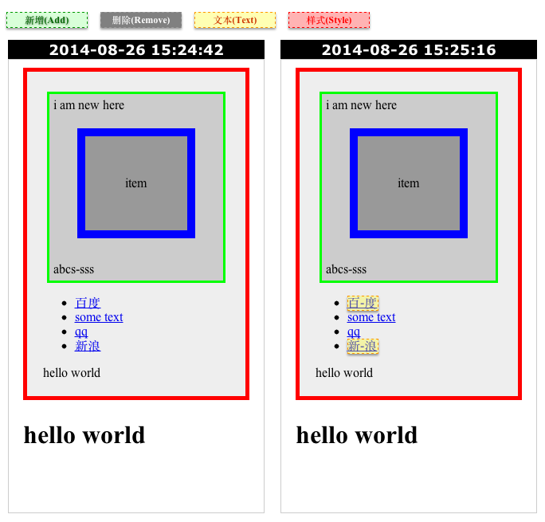
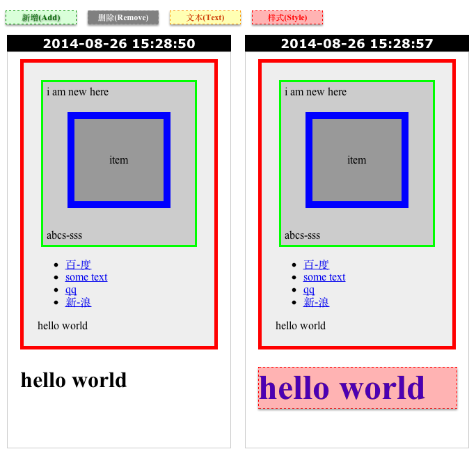

## Page Monitor

> capture webpage and diff the dom change with [phantomjs](http://phantomjs.org/)

## Effects

### Element Add



### Element Removed



### Text Changed



### Style Changed



## Make UI to show diffs of history

> https://github.com/fouber/pmui


## Usage

> First of all, install [phantomjs](http://phantomjs.org/download.html), page-monitor relys on [phantomjs](http://phantomjs.org/) to render webpage and genenrate screenshot. DO NOT use ``npm`` to install phantomjs on winidows, it can't be launched by ``spawn``.

```javascript
var Monitor = require('page-monitor');

var url = 'http://www.google.com';
var monitor = new Monitor(url);
monitor.capture(function(code){
    console.log(monitor.log); // from phantom
    console.log('done, exit [' + code + ']');
});
```

## API

### Monitor

```javascript
var monitor = new Monitor(url [, options]);
```

see the default options here: [https://github.com/fouber/page-monitor/blob/master/index.js](https://github.com/fouber/page-monitor/blob/master/index.js#L57-L179) , you can override any option for your monitoring.

### monitor.capture(callback [, noDiff]);

caputure webpage and save screenshot, then diff with last save.

```javascript
var monitor = new Monitor(url, options);
monitor.on('debug', function (data) {
    console.log('[DEBUG] ' + data);
});
monitor.on('error', function (data) {
    console.error('[ERROR] ' + data);
});
monitor.capture(function(code){
    console.log(monitor.log.info); // diff result
    console.log('[DONE] exit [' + code + ']');
});
```

### monitor.diff(left, right, callback);

diff change between left(date.getTime()) and right(date.getTime()).

```javascript
var monitor = new Monitor(url, options);
monitor.on('debug', function (data) {
    console.log('[DEBUG] ' + data);
});
monitor.on('error', function (data) {
    console.error('[ERROR] ' + data);
});
monitor.diff(1408947323420, 1408947556898, function(code){
    console.log(monitor.log.info); // diff result
    console.log('[DONE] exit [' + code + ']');
});
```

### events

```javascript
var monitor = new Monitor(url);
monitor.on('debug', function (data) {
    console.log('[DEBUG] ' + data);
});
monitor.on('error', function (data) {
    console.error('[ERROR] ' + data);
});
```

* ``debug``: debug from phantom
* ``notice``: console from webpage
* ``info``: info from phantom
* ``warning``: error from webpage
* ``error``: error from phantom
